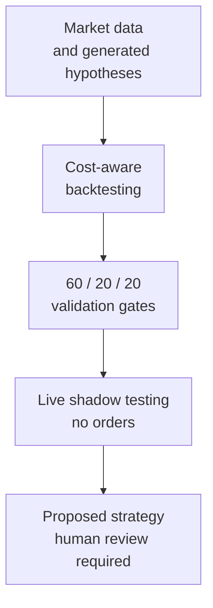
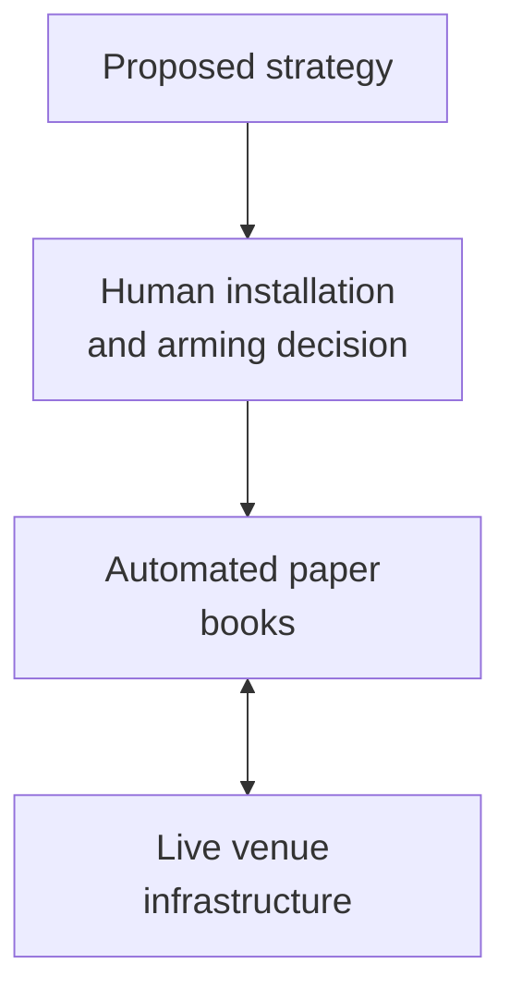
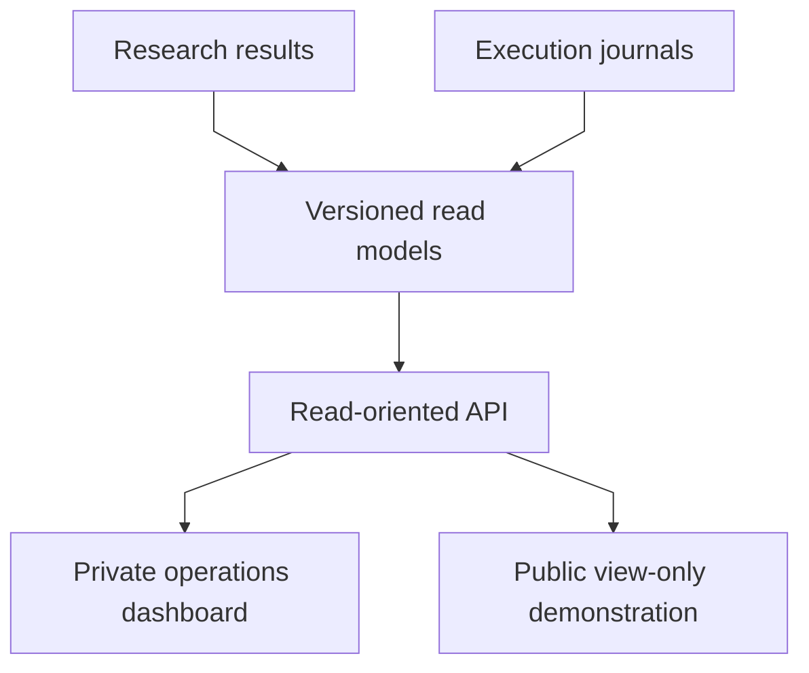
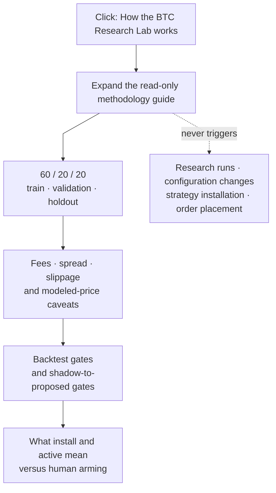

# Forge — automated quantitative research and trading infrastructure

This README is the public technical overview and navigation guide for Forge.
It introduces the platform's research mandate, automated trading books,
production safeguards, public/private boundary, technology stack, and current
operating status, then directs readers to the detailed methodology, safety,
architecture, and design documents in this repository.

**Live read-only demonstration: [forge-view.5.78.193.177.sslip.io](https://forge-view.5.78.193.177.sslip.io)** — production data, no authentication required, and no capability to place orders.

Forge is an end-to-end automated quantitative research and algorithmic trading
platform deployed on a single Linux server. The platform systematically
generates multi-variant trading strategies and rigorously backtests them
against measured market costs, including live exchange fees and observed
bid–ask spreads rather than theoretical estimates. To preserve statistical
integrity, surviving models undergo shadow testing through live, order-free
prediction streams. Strategies that clear the platform's strict,
risk-adjusted performance thresholds become eligible for human-approved
installation in three automated paper-trading books operating continuously
across Kalshi and Alpaca.

The public demonstration exposes the real production dashboard and live research outputs through a deliberately constrained, read-only interface. The complete source remains private because it operates continuously against connected brokerage and exchange accounts; this repository provides an auditable technical overview, including focused excerpts from the production codebase.

## System at a glance

### Research lifecycle

### From proposal to paper execution

### From recorded state to readers

Research, live observation, strategy eligibility, execution, and presentation
are separate responsibilities. Passing a statistical gate does not authorize
an order: it produces a proposal that still requires a human installation and
arming decision. The public interface is downstream of recorded state and has
no path back into trading controls.

## The BTC Research Lab guide

The row labeled **“How the BTC Research Lab works”** on the Research page is a
read-only methodology accordion. Clicking the row expands or collapses an
explanation; it does not start research, change a threshold, select a strategy,
arm a service, or place an order.

The expanded guide reads current methodology values from the dashboard data so
its fee and friction descriptions remain aligned with the research engine. It
also makes the critical distinction between **installing** a tracked research
selection and **arming** an execution service: installation records which
variant the research surfaces treat as selected; arming remains a separate,
human-controlled action outside the research page.

## What this repository demonstrates

| Engineering area | Public evidence |
|---|---|
| **Quantitative research systems** | Automated strategy-family generation, chronological validation, measured transaction costs, multiple-testing correction, and retained negative findings. |
| **Safety engineering** | Sandboxed model-generated code, shared backtest/shadow logic, independent execution gates, and incident-derived regression controls. |
| **Production platform design** | Priority-aware resource scheduling, service supervision, deployment serialization, monitoring, and graceful degradation on constrained hardware. |
| **Full-stack product engineering** | A typed API and production dashboard that preserve measurement scope, exact calibration, and risk semantics across private and public surfaces. |
| **Operational judgment** | Documented failures, adverse recalibrations, rejected hypotheses, and explicit boundaries between validated behavior and work that remains unproven. |

## Automated trading books

| Book | Venue | Mandate |
|---|---|---|
| **BTC 15-minute predictor** | Kalshi binary markets | Executes the research pipeline's highest-ranked algorithm against 15-minute BTC up/down contracts. Every performance statistic is scoped to the current strategy version and labeled accordingly. |
| **Equity trader** | Alpaca, $1 million paper account | Maintains a long-only, conviction-weighted portfolio selected from a 600-company research universe, with a dynamic Treasury-bill reserve and an LLM reviewer serving strictly in an advisory capacity. Performance is benchmarked against SPY rather than against zero. |
| **Options trader** | Alpaca, cash-secured-put wheel | Independently scans, opens, manages, and closes positions three times per trading day. Every decision is recorded with its underlying rationale. |

All three books trade paper capital through live venue infrastructure. The objective is to validate the machinery under realistic operating conditions, not to curate favorable returns; the public landing page therefore reports every book's live P&L, including flat or negative performance.

## Technical documentation

- **[Engineering case study](docs/ENGINEERING.md)** — Provides an employer-oriented account of the system's scope, the hardest engineering problems, the decisions used to resolve them, and the evidence available for technical evaluation without exposing the private implementation.
- **[Methodology](docs/METHODOLOGY.md)** — Details the measured spread model that repriced the leading strategy from +$67.53 to −$26.50; the multiple-testing correction that prevents 33,000 trials from manufacturing significance; and three formal studies whose conclusion was not to proceed.
- **[Safety](docs/SAFETY.md)** — Describes how LLM-generated strategy code is statically screened and executed inside a network-isolated bubblewrap sandbox with a read-only filesystem. It also documents the stop-loss ordering defect that produced four identical −$5,927 backtests and the independent controls that keep live execution subject to explicit human authorization.
- **[Architecture](docs/ARCHITECTURE.md)** — Maps the complete runtime on a four-core, 8 GB server, including the scheduler change that taught low-priority research workloads to yield correctly to live services and the deployment failure caused by a single committed symlink.
- **[Design](docs/DESIGN.md)** — Defines the dashboard's data-integrity rules: every performance metric carries its measurement window, calibrated values retain their exact precision, and color communicates financial risk rather than operational activity.

## Public/private boundary

The demonstration is the production dashboard compiled with a view-only flag. It uses the same components and live backend, but removes every surface associated with private account data or operational control:

- **Personal brokerage data.** The private dashboard includes live holdings, P&L relative to cost basis, deposit-adjusted S&P 500 benchmarking, risk analysis, orders, watchlists, and position-specific AI recommendations. The public equity view contains model output only; selecting a symbol exposes research, never personal positions.
- **Live options positions.** The private options workspace covers owned puts, per-contract P&L, cash-secured-put recommendations, and covered-call analysis against actual lots. The public demonstration retains only the scanner.
- **Interactive AI workflows.** The private dashboard includes free-form research queries and on-demand analysis generated by local and frontier models. Because those workflows require write requests, the public gateway rejects them and serves explicitly labeled cached analysis instead.
- **Operational controls.** Strategy installation, algorithm switching, service arming, and promotion-threshold configuration are excluded from the public bundle at compile time and independently rejected by the gateway with HTTP 403.
- **Perpetual-futures research.** The research pipeline evaluates two venues, but the public interface centers on 15-minute binary markets. The perpetuals program is dominated by negative findings and is documented in the methodology rather than presented without the context required to interpret it responsibly.
- **Unrelated private systems.** Forge also operates a Discord-based agent fleet, an MCP service for mobile access, and private investment-club infrastructure. These systems are intentionally outside the public product surface.

## Technology

Python research engines using NumPy and pandas; walk-forward and LLM-generated strategy families; FastAPI; Next.js 14; systemd services and timers on a single Linux VPS; local inference through Ollama; frontier models for strategy design; and GitHub Actions connected to a self-locking deployment pipeline.

## Related project

[Concordia](https://github.com/rohanjoglekar/voteconcordia) is a real-money, vote-governed investment club that executes a shared portfolio mandate independently within each member's own brokerage account. It applies the same operating principle: preserve availability where doing so protects participants, and fail closed wherever uncertainty could affect capital.

## Operating status

The research pipeline runs continuously, and all three automated books execute against paper accounts on live venues. Enabling live trading remains a manual, human-authorized action by design.

Contact: rohannj29@gmail.com
