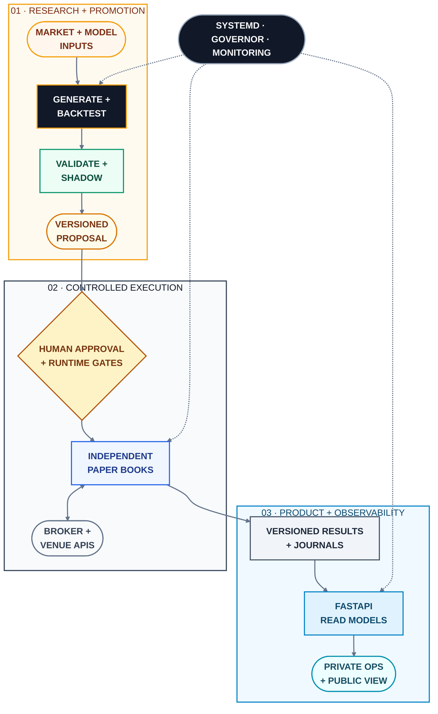

# Architecture — consolidated production deployment

This architecture document describes how Forge's research, trading,
application, inference, networking, and deployment components operate together
on a single four-core, 8 GB Linux VPS. It maps the service topology, resource
priorities, serialized deployment path, and boundary between the authenticated
dashboard and its public read-only build. The design treats resource
contention as a first-class constraint so priority-sensitive trading workloads
remain deterministic on shared hardware.

## Production topology



The diagram is intentionally architectural rather than source-level. It shows
runtime responsibilities, promotion flow, and trust boundaries while
omitting private package structure, account identifiers, configuration values,
and venue-specific execution logic.

## The service map

- `forge-btc-lab-daemon` — Continuously performs strategy generation,
  backtesting, admission to live order-free shadow testing, and promotion
  accounting at low CPU priority (`nice 15`).
- `forge-knn-perp` and the binary-market shadow service — Generate live-market
  predictions on 15-minute intervals and occupy the execution path closest to
  real capital.
- `forge-dashboard-api` (:8700) and `forge-dashboard-web` (:3000) — Serve the
  FastAPI and Next.js private dashboard behind nginx Basic Authentication.
- `forge-view` (:3001) — Serves the public demonstration from the same
  component tree, compiled in view-only mode and placed behind a GET-only
  gateway.
- Ollama — Provides local inference for research review and generated
  summaries. The runtime permits one loaded model and disables swap
  (`MemorySwapMax=0`) because memory paging makes local inference operationally
  slower than omitting it.

## Priority-aware CPU throttling

The research daemon must yield capacity to live trading, the API, and model
loading. Its original throttle used the one-minute load average. Seven days
of observation showed that this signal was unsuitable: system load never fell
below 4.0, and the daemon yielded 307 times in 5¼ hours, leaving it idle for
73% of elapsed time. Linux load average is insensitive to process priority;
because approximately 74% of CPU consumption came from `nice 15` research,
the daemon repeatedly interpreted its own low-priority workload as contention.

The replacement reads `/proc/stat` and calculates the fraction of total CPU
capacity consumed by **normal-priority** work. This isolates the live trader,
API, and Ollama's approximately 281% model-load spikes from low-priority
research processes:

```python
# algo-trading/btc_lab/loop.py
def _nonnice_busy_frac(window_s: float) -> float | None:
    """Fraction of TOTAL cpu capacity spent on NON-NICE work over `window_s`.

    Why not the 1-minute load average, which this replaces: loadavg is
    nice-BLIND. On this box ~74% of CPU is `nice` — overwhelmingly the daemon's
    own nice-15 peers ... So `load1 > ncpu × frac` was a tautology: the daemon
    yielded because research was running, which is the thing it was trying
    to do."""
```

Following the change, the daemon recorded no spurious yields and evaluated
eight strategy families during the same wall-clock interval previously lost
to idle waiting. The implementation retains the one-minute load average as a
degraded fallback if `/proc/stat` cannot be read, ensuring that monitoring
failure does not disable throttling entirely.

## Serialized deployment pipeline

Every push to `main` executes smoke tests through GitHub Actions before
connecting to the server and invoking `infrastructure/deploy.sh`. The script
reconciles the checkout to the approved commit, reasserts nginx authentication
and routing invariants, restarts services affected by changed paths, and
rebuilds the public application. Two controls originated from production
incidents:

- **Mutual exclusion.** An automated deployment and a manual build once ran
  `npm` concurrently against the same working tree, corrupting the dependency
  installation. Automated and manual deployment paths now acquire the same
  `flock` lock before modifying build state.
- **Tracked-artifact verification.** For ten days, the public application
  repeatedly failed after deployment with `next: not found` despite clean
  dependency rebuilds. The root cause was a tracked `node_modules` symlink to
  an absolute path on the development Mac. The `.gitignore` entry
  `node_modules/` matched directories but not the symlink, allowing it into
  version control; every `git reset --hard` then restored the dangling
  `/Users/...` target over the server's newly installed dependencies. Removing
  the path from the Git index resolved the incident. The resulting operational
  rule is explicit: when a deployment repeatedly removes an artifact, inspect
  the repository's tracked object type before diagnosing the package manager.

## One component tree, separate public capability

The public and private applications share one component tree. A compile-time
`VIEW_ONLY` flag excludes mutating controls, ensuring that data-integrity and
presentation fixes reach both surfaces without maintaining a divergent fork.
The public landing page reads from a dedicated `/api/landing` endpoint that
returns approximately 2 KB of aggregate counts and downsampled sparkline data;
the corresponding full-section payloads range from 600 KB to 2.5 MB. Static
content renders independently, while live values appear only after a
successful response, preventing transient API failures from displacing the
page with loading or error states.

## Public disclosure boundary

This public architecture describes the control flow necessary to evaluate the
engineering: how research becomes evidence, how evidence becomes an eligible
strategy, how eligible strategies reach paper execution, and how production
state reaches authenticated and public interfaces. It intentionally excludes
private source code, strategy parameters, credentials, account topology,
internal hostnames, mutable control endpoints, and operational recovery
commands. Short excerpts elsewhere in this repository are selected to explain
a safety or statistical property and are not sufficient to reproduce the
production system.
