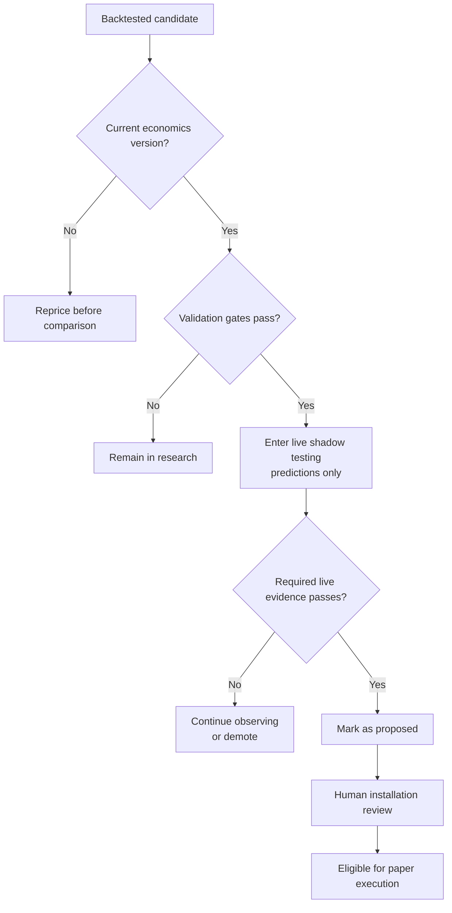

# Engineering case study — Forge

This engineering case study explains what Forge demonstrates as a production
software project, which technical problems required the most judgment, and
what evidence an employer can evaluate in this public repository. It is a
system-level account derived from the private production implementation; it
does not publish proprietary strategy logic, source structure, credentials,
account details, or executable control paths.

## Project scope

Forge combines quantitative research automation, market-data processing,
statistical validation, model-assisted strategy generation, paper execution,
operational monitoring, and a full-stack dashboard on one continuously running
Linux server. The private monorepo spans Python research and trading services,
typed web applications, broker and venue adapters, local-model workloads,
service definitions, deployment automation, and more than 700 Python test
functions distributed across Forge's research, execution, adapter, and product
services.

The engineering objective is not simply to discover a profitable backtest. It
is to build a controlled path from hypothesis generation to production
observation while preserving the economics, evidence, and operational state
required to decide whether a result should be trusted.

## Strategy promotion decision map

The automated pipeline can advance a candidate only as far as **proposed**.
The final transition into an executing paper book remains an explicit human
decision, preserving a clear boundary between statistical eligibility and
operational authority.

## Hard problems and decisions

| Problem | Engineering decision | Public evidence |
|---|---|---|
| Backtests can manufacture performance through optimistic friction. | Price every result with venue-specific fees and observed order-book spread, then version those economics independently from engine releases. | The leading binary strategy was repriced from +$67.53 to −$26.50 after measured spread replaced a theoretical estimate. |
| Searching thousands of candidates makes chance winners inevitable. | Raise the promotion threshold with concurrent candidate count and reserve chronological holdout data for final evaluation. | More than 33,000 variants remain subject to family-wise error control and train/validation/holdout isolation. |
| Generated Python is useful for research but unsafe to trust. | Combine static syntax screening, process resource limits, non-executable result transport, and network-isolated OS sandboxing. | The safety document describes the independent containment layers and their threat assumptions. |
| Offline and live behavior can silently diverge. | Reuse decision and exit logic across backtesting and shadow evaluation, then reconcile live signal frequency against historical expectations. | The stop-loss ordering incident shows why shared code paths and parity tests are safety properties. |
| Research can starve latency-sensitive services on a small server. | Run research at low priority and throttle only against normal-priority CPU consumption rather than priority-blind load average. | The revised governor eliminated 307 spurious yields observed during a 5¼-hour interval. |
| A public portfolio piece must be credible without exposing production control. | Compile the real dashboard in view-only mode, enforce GET-only access at the gateway, and expose purpose-built read models instead of private account surfaces. | The live demonstration uses production components and current research state while excluding mutation and personal-account capability. |

## Verification strategy

Forge uses verification appropriate to each boundary rather than treating one
test suite as sufficient:

- Pure research and accounting logic is exercised through unit and regression
  tests, including parity checks between offline and online decision paths.
- Strategy promotion uses chronological data separation, risk-adjusted
  statistics, economics-version compatibility, and minimum evidence floors.
- Shadow testing runs live predictions without orders and compares production
  behavior with backtest expectations.
- Paper books exercise venue connectivity, scheduling, state persistence,
  reconciliation, and reporting without authorizing real capital.
- Operational controls monitor service freshness, serialize deployments, and
  preserve safe fallback behavior when telemetry or data is unavailable.

## Selected engineering outcomes

- Recalibrated transaction costs even when the correction eliminated apparent
  profitability, preserving the integrity of downstream promotion decisions.
- Converted a priority-blind compute throttle into a workload-aware governor
  suitable for mixed research and trading services on constrained hardware.
- Traced a ten-day deployment failure to Git object semantics rather than the
  package manager and converted the incident into a tracked-artifact check.
- Preserved negative research programs as first-class results, preventing
  unsupported maker, timeframe, and pair-trading work from advancing.
- Built one product surface for both private operations and public evaluation,
  with capability removed at build, gateway, and data layers.

## What an employer can evaluate

The public repository is designed to support discussion of system design,
quantitative methodology, security boundaries, production operations,
incident response, API and interface design, and engineering trade-offs. The
live demonstration provides behavioral evidence; the linked documents provide
reasoning and measured outcomes; and the selected excerpts show representative
implementation discipline without disclosing enough source to recreate the
private platform.

## Intentional omissions

The public version does not include complete source code, live or paper
credentials, account identifiers, private holdings, proprietary strategy
configurations, raw operational logs, internal network details, mutable API
contracts, or deployment and recovery commands. These omissions protect both
the production environment and the research while leaving the architecture,
failure modes, controls, and engineering results open to review.
